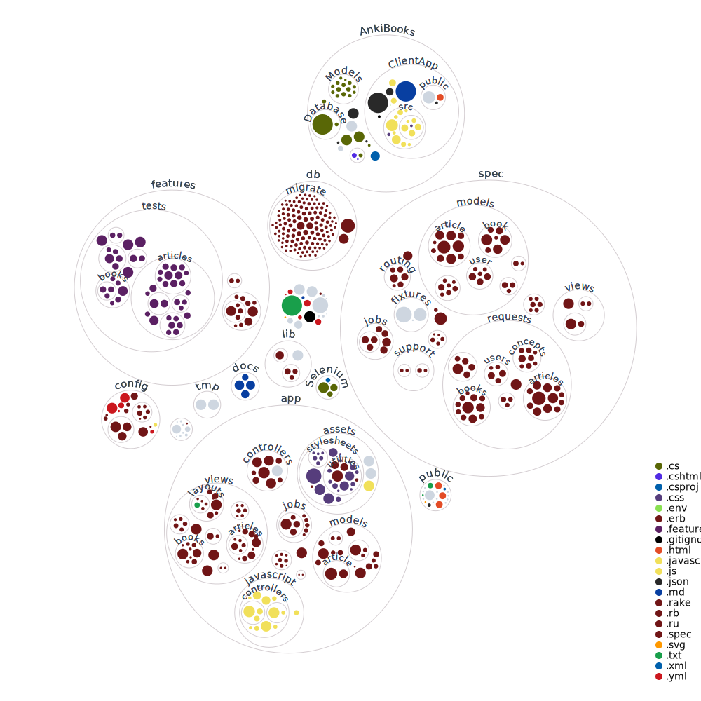

# Anki Books

## README

Anki Books is a note-taking and flashcards app that complements the desktop app Anki (unaffiliated with Anki, AnkiDroid, etc.). You can usually see it at [ankibooks.io](https://ankibooks.io).

## Setup notes

[How to setup development Anki Books with WSL2 Ubuntu (Windows 11)](https://kylerego.github.io/setting-up-development-ankibooks)

## Code base map

